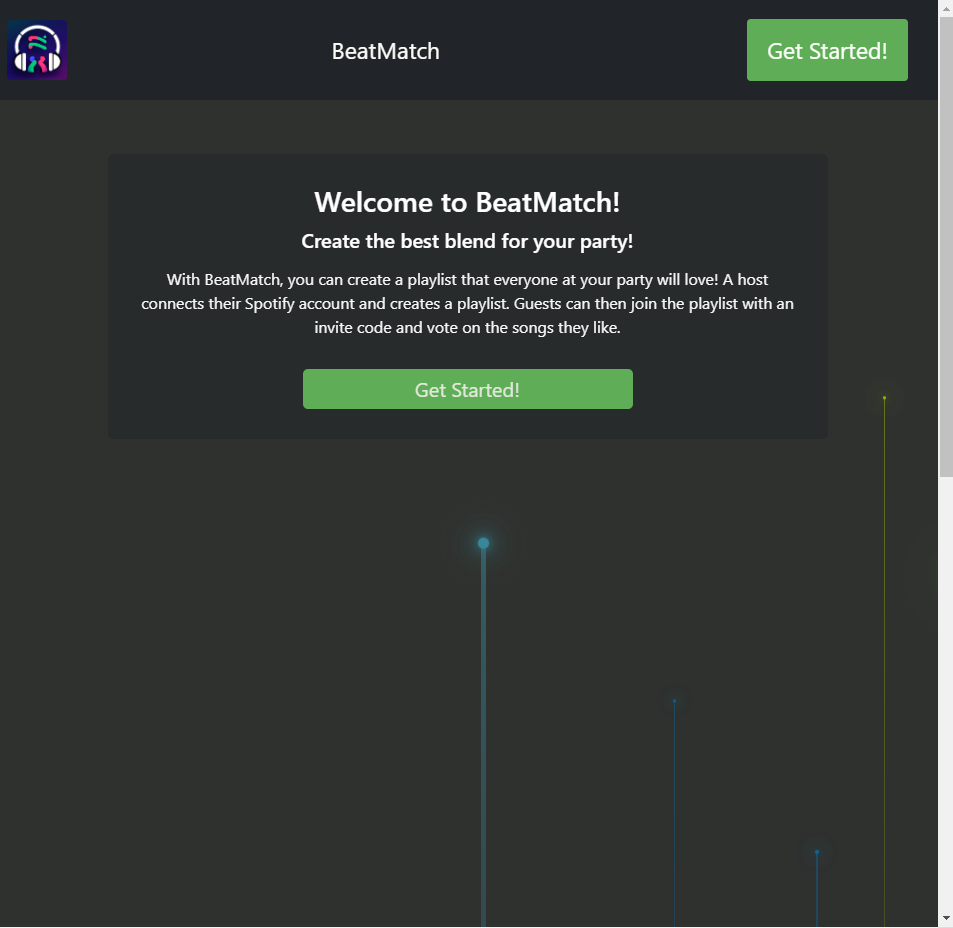
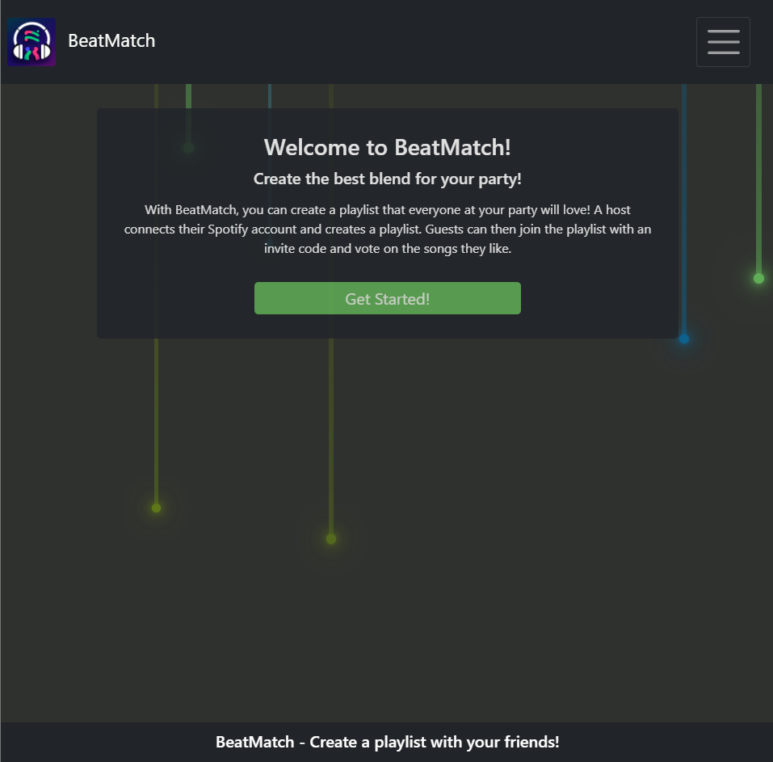
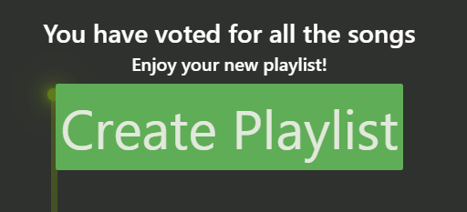
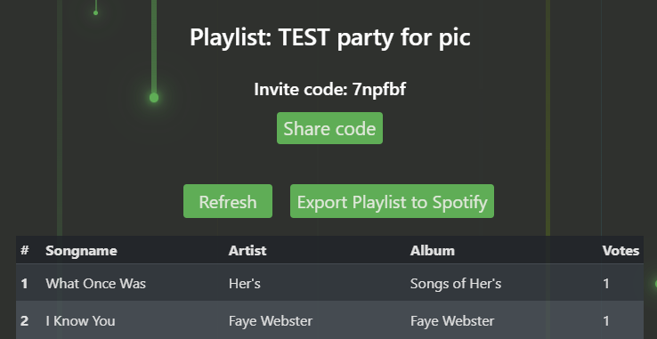
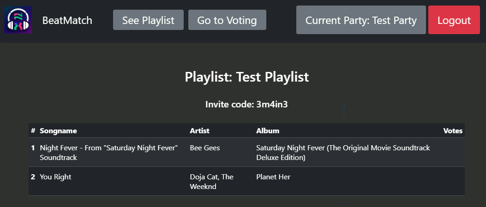
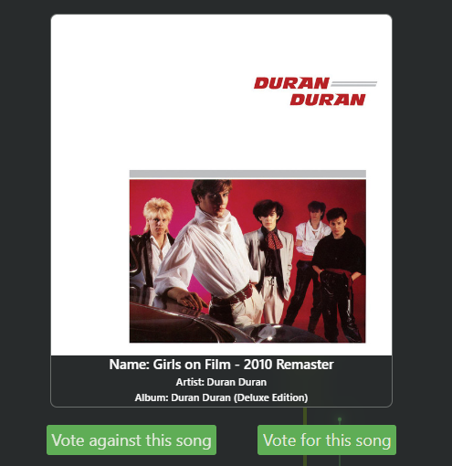
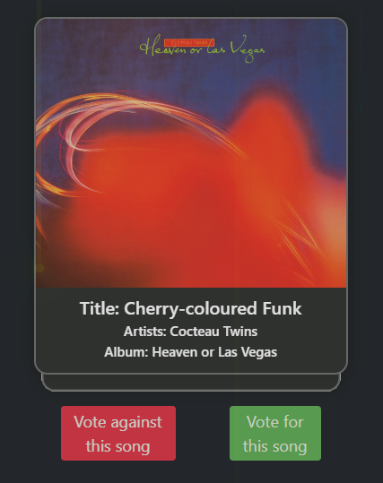
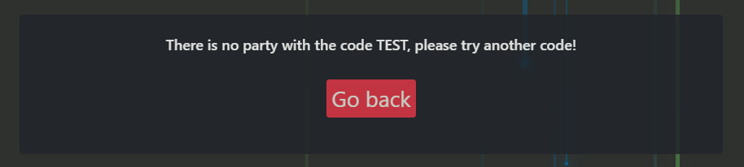
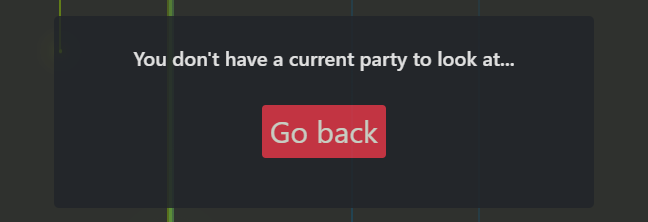
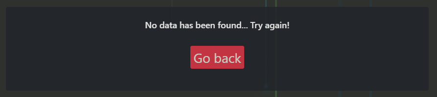

# First User Test
## Overview
| Date | 5th of April |
|--|--|
| **Test User** | Laura, 21 years old. Studies Computer Science, but is not enrolled in this course. |
| **Time** | Around 40 minutes. |
| **Summary** | We conducted the first user test similarly to the one in the lab. We gave Laura one of our computers to use the app and let her think aloud about what she was doing and what she noticed with the webpage. During this we all made individual notes. After the review, we consolidated the notes and decided on the adaptations we would implement. The following notes are a list of these consolidated notes and the subsequent improvements and implementations. The consolidated notes are divided into general subcategories depending on what the feedback relates to. |

## Consolidated Notes
### Layout, Looks, & Navigation
| Feedback | Improvement/Implementation| Related Picture |
|--|--|--|
| The test user found it confusing that you could scroll down on pages where it was not needed. | This was an issue with the moving background. The circles/lines were generated at the bottom of the browser window, and the animation of the circles/lines extended farther than the hight of the browser window, which caused this issue. This was fixed by flipping the animation, making the circles/lines generate at the top and having the animation not go past the hight of the browser window.| Before (note the vertical scroll bar):  After:  |
| The test user did not understand what the button `Create New Playlist` meant. She expressed wanting a more intuitive name that  better described what the button  did. | Changed button name to `Export Playlist to Spotify`, which is better description of what the button does. | Before:  After (note that the button has also been moved to `Current Playlist` view for better usability):  |
| When the test user used the website as a guest, she found it unnecessary to have two buttons in the header leading to the view of the current playlist, i.e. the `See Playlist` and `Current Party` buttons. | We changed the `See Party` button to `Current Party` and removed the old `Current Party` button.  | Before:  |
| The test user expressed feeling confused about difference between the terms '*party*' and '*playlist*' in our app. | We made the terminology consistent across the app, favouring the term '*party*' and only using the term '*playlist*' when it directly translated to a playlist from Spotify or a playlist being exported to Spotify. | |
| The test user did not realize some of the buttons in our app were, in fact, buttons. | We made the style of all the buttons more consistent and look more like buttons. | |
| The test user liked the '*vibe*' of our logo and said the relation between ours apps intentions and the logo was clear. It did, however, remind her of an ad when placed in the navigation bar. | We intended to change the temporary logo, but ultimately decided to keep it. We grew accustomed to it. | |
| The test user expressed feeling like the app did not having a clear home page, which she felt was a lacking feature. When clicking on the logo in the navigation bar, she was brought back to the very start of the app (welcome view). She would have wanted to go back to her existing parties, to the voting session, an interface to create new parties, or similar. | To fix this, we made the 'home page' of the host the *'#allplaylists'* hash, which at this moment contained all the host's playlist from Spotify, ant later also the host's previous parties. This felt to us like to most obvious and useful 'home page' for a host. For the guest, the most logical 'home page' to us felt like the `Current Party` view in the *'#playlist'* hash, as this gives the guest the greatest overview. Note that the guest is first taken to the voting page when connecting, since this is the most important task for the guest, but if the guest clicks on the logo in the navigation bar, the guest is taken to the `Current Party` view. | |
| The test user did not like the background of moving lines/circles, saying it wasn't clear how it related to Spotify. She did point out how she did not mind a *moving* background, but did not think it was necessary. | For some time after this user test, we had intentions to change the background but kept it for the time being. The moving background was still there during the Mid-Project review and on the contrary to our test users opinion, the feedback we got from the Mid-Project review were overwhelmingly positive about the moving background, including expressing it emulated the party feeling of the app. Because of this, we ditched our test user's feedback and kept the moving background. The only changes made were to the background related to improving the layout and lines/circles generating outside of the window size, as described earlier above. | |
| The test user expressed finding the `like` and `dislike` buttons to similar and to perhaps moving them to the left and the right side of the cards respectively. | We made the button more different giving the dislike button a red color. We had some ideas of making the buttons more fun, like with a heart and a broken heard, a thumbs up and thumbs down, etc. but ultimately decided to keep it simple with a plain text since it made it super clear to the user what the buttons do. | Before:  After:  |
| The test user pointed out that the button `Go to Voting` in the header is visible in views where it does not make sense, such as when when the user is logged in as a host and has not created a party yet. | For some time, we decided to conditionally render the buttons depending on where the user was on the website, and fixing '*issue*' relating to this by not rendering the `Go to Voting` button when the user was currently voting. However, because of feedback from our second user test review, we decided to always display all buttons available to the user in the navigation bar all the time. If there is no party to view or vote on, this message will instead be displayed saying this instead, for better usability and guidance. | After, when guest user tries to connect to a party that does not exist:  After, when a host user tries to go to `Current Playlist` view and the voting session respectively when there exists no current party:   |

### Functionality
| Feedback | Improvement/Implementation| Related Picture |
|--|--|--|
| The user expressed wanting to add songs that are not in the playlist to the party when creating a party.| This is not a bad idea, but we did not implement this since we deemed it wasn't that important in comparison to other things. If a user really wants to add new songs to a party, the user can add the songs to the Spotify playlist and then create a new BeatMatch party. | |
| The user expressed that it would be fun to have an option to play the current song you are voting on right now (out loud) during the voting session | We imagine this feature could lead a auditory mess for the users if multiple users who are voting are in the same room, especially since the users are likely not voting on the same song at the exact same time. This feature could have been made an optional feature the host could enable, but we ultimately decided to not implement this idea due to it potentially worsen the user experience, and to only look into it if we had time over. |

### Usability
| Feedback | Improvement/Implementation| Related Picture |
|--|--|--|
| The test user thought that voting for every song in the playlist was overwhelming. She said she would like a way to opt out of voting at any moment in the voting session. | This is something that was also brought up during the second user test review, and we aided both test users concerns by allowing the user to leave the voting session whenever and having the `Export Playlist to Spotify` button always available in the `Current Party`view. This something we always planned on doing, to ensure that the users do not get overwhelmed.|  |

### Miscellaneous

| Feedback | Improvement/Implementation| Related Picture |
|--|--|--|
| The test user said she likes the functionality the app gives, and that she would use the app. | We kept going in the direction we were going! | 😀 |

