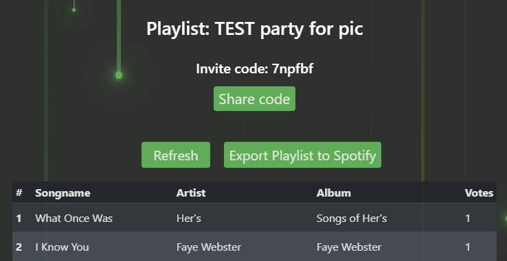

# Second User Test
## Overview
| Date | 2nd of May |
|--|--|
| **Test User** | Büshra, 23 years old. Studies Computer Science, but is not enrolled in this course. |
| **Time** | Around 40 minutes. |
| **Summary** | We conducted the second user test similarly to the one in the lab and in the same fashion as the first user test we did. We gave Büshra one of our computers to use the app and let her think aloud about what she was doing and what she noticed with the webpage. During this we all made individual notes. After the review, we consolidated the notes and decided on the adaptations we would implement. The following notes are a list of these consolidated notes and the subsequent improvements and implementations. The consolidated notes are divided into general subcategories depending on what the feedback relates to.|

## Consolidated Notes

### Layout, Looks, & Navigation
| Feedback | Improvement/Implementation| Related Picture |
|--|--|--|
| The test user did express a desire to not have two `Get Started` buttons in the welcome page (one in the navigation bar and one in the middle of the page)  | We removed the one in the navigation bar, favouring the more obvious one in the middle of the page. | Before:  |
| The test user pointed out that the `Home` button sometimes disappears due to sometimes using all lowercase and sometimes using camel case in the URL hash. | We fixed this issue and started being consistent, favouring lowercase.  |  |
| Similarly to a comment made in the first user review, this test user also expressed that the button for exporting the playlist to Spotify should express that, and not say `Create Playlist`. | We changed the name of the button to `Export Playlist to Spotify`. | Before:  After (note that the button has also been moved to `Current Playlist` view for better usability):  |
| The test user did not like that the buttons in the header disappeared when she clicked on them. She expressed always  wanting the navigation buttons to be there, to get a better overview of the app. | We made the buttons in the navbar never disappear. For a while, we implemented a feature where the button that lead to the user to the current view was and looked disabled, but we ultimately scrapped this as our implementation interfered with the collapsible toggle navigation bar and we did not have enough time to make both features work at the same time. We deemed the collapsible toggler navbar more important, as it was necessary for mobile navigation. | Example before: `Current Playlist` button not shown in navigation bar since the user is currently viewing the current playlist.  |
| The test user said the headers in the home page of the host looked clickable, which they aren't. | We removed the underlining of the header text to not make it look like a clickable link. | Example of a header before:  |
| The test user said the Chrome popup felt "scammy", and thus also making the website seem like a scam. | We changed the chrome popup to a React dialog, which in our opinion looks nicer and made it feel less "scammy". | Before:  After:  |
| The test user said the button `Current party` was a bit unintuitive and that something along the lines of `View playlist` describes the action better. | We choose not to change this since we thought that it is more intuitive when we use the word party on other places in the application and we want to keep it concise.   |  |

### Functionality
| Feedback | Improvement/Implementation| Related Picturea & Information |
|--|--|--|
| The test user felt that the profile page could be more useful and more similar to Spotify's profile page. | We designed a more interesting profile page with the user's profile picture from Spotify. As a creative improvement, we also added more fun and useful information and statistics. | Before:  After:  |
| The test user said the `Sort` button was okay, but not necessary. She said it would be more useful to indicate which songs are getting exported to Spotify. | We removed this feature, since it test user said it was unnecessary. Instead, the current playlist is always sorted by votes, where songs with the highest votes are at the top and songs with the same amount of songs sorted by their order in the original playlist | Before:  |
| The test user tried to view the current party's playlist, when there was no current party which put the user in an infinite loading screen.  | We fixed this by displaying `You don't have a current party to look at...` and a `Go back` button when the user doesn't have a current party. | After:  |
| The test user did express how she would not want the final exported playlist to contain songs that got a negative number of votes in total. | We implemented this and making this clear to this to the user by adding a dividing bar in the `Current playlist` view that says this. | After:  |
| The test user thinks the party name should be customizable. | We implemented this feature. By default,  the new party has the same name as the playlist it was created from, but the host has an option to change the name in an input box before voting. We really liked this idea since it would give the user a easy option to separate and keep track of their parties. | After:  |
| The test user said she would like something like a search feature to find the playlist she wants. She also thought this could be useful when viewing the current party to find a specific song and its current rating. | We liked this idea and kept it in mind, but ultimately did not implement it due to time limitations. |  |
| The test user said that the `Share` button should copy the code to clipboard. | We implemented this, as the `Share` button had previously done nothing until this point in time. To the left is what the content copied to clipboard looks like, where `Party Code` will be the party code. A dialog box also pops up to confirm to  the user that the party code is copied. | After:  Join my party on BeatMatch with the code: `Party Code` Visit: https://kth-project-det-eme-hum-sof.web.app/#welcome |
| The test user suggested to add a button that removes negative votes after the voting session. She said it was a bit confusing on which songs would be exported to Spotify when viewing the votes in the `Current Party` view.| We chose to not remove the negative votes when viewing the list. Instead we chose, as mentioned above, to make it more clear to the user that only songs with a total of 0 or more votes gets added to the new list. A divider in the table is also used to show which songs that will be removed, which gives the user a better overview. |  |
| The test user said she would like the option to change her voting in the current playlist view, in case she regretted the way she voted for one of the songs. | We decided not to implement this since we as a group don't think being this nitpicky and serious about your own votes is in line with the *vibe* of the app, in lack of a better word. The app is supposed to be fun and quick, not a serious and statistical excel document. |  |
| The test user expressed the desire of being able to copy the link to the newly created playlist on Spotify with the party guests. | We decided not to implement this since the purpose of the application is to listen to the playlist together and the feature would not add value to the user since it already is so easy to send playlists to someone on spotify. It's not a bad idea, but not the most important when we has other more important functionality to implement in time. |  |

### Usability
| Feedback | Improvement/Implementation| Related Picture |
|--|--|--|
| The test user wondered if the playlists presented in home page for host was her playlists (the test user was logged in with one of our accounts and did therefore not recognize the playlist names). | We realized that it could be the case that somebody else than the owner of the Spotify account uses the connected BeatMatch account and that the guidance the app gives could be improved. |  |
| Similarly to a comment made in the first user review, this test user also expressed worrying about having to vote for all songs in long playlist, as it felt tiresome and overwhelming. | When a user is voting they can always choose to stop voting when they want to. The host can also choose to not vote for all the songs in the list. In the current playlist view there is a button to export the list to spotify and this is accessible during the whole voting session. This feature was not implemented when the user test took place, but it was something we always planned on doing, to ensure that the users do not get overwhelmed. |  |
| In related fashion to the note above, the test user liked that leaving the voting page and then going back to the voting page does not reset the voting she already had done. | We kept this feature. |  |
| The test user was concerned about issues when the host has many playlists on spotify, which would make the home page for the host very long. | We decided to implement a feature where the page only loads the 15 latest playlists. If the user wants to see all of their playlists, there will be a button where the user can click there to load the rest. | After:  |
| The test user liked the display of negative votes and said it gives her as a user value. Negative votes show that people really don't want a song, in her opinion. | Negative votes were something we were unsure about, since it might be confusing for the user what a negative score means. Our test user's comment made us sure in our decision to keep them instead of finding another solution.  |  |
| The test user did not find it obvious why she (as a host) had to log in with Spotify *and* create an account in our app. The `Login` button is confusing, since it connects the user to Spotify, and does not make the user log in to our app. | We changed the name of the  `Login` button to `Connect to Spotify` and `Login`/`Register` to make it more clear to the user that these are two separate things needed. | The user will first be prompted to connect to Spotify (if the user wants to be the host):  After host user has connected to Spotify, they will be prompted to log in or register if they haven't created an account before:   |
| The test user did not have a clear opinion on what to do when a user does not know a song during voting. She said the issue was "tricky" and that an additional button for skipping the song could be useful. | We decided to not implement a button for skipping, since we came to the conclusion that a button for skipping defeats the purpose of the app. The apps functionality relies on votes and the exported playlist from Spotify would not be as useful or fun if hardly anything had changed from the original playlist. One could also argue that if a user doesn't know a song, the user could still give valuable feedback in their votes. Voting for the song would mean '*I don't know this song, I don't mind it and I want to find out*' and voting against the song would mean '*I don't know this song, but I do not want to find out since I only want to listen to songs I already know*'. |  |
| The test user expressed feeling confused about the parties listed in the `Existing parties` view. She was especially confused about what `Party Date` meant as it, in her opinion, could mean both the date the BeatMatch voting party was created and the date of the in real life party that the BeatMatch voting party was made for. She also mentioned that having two parties with the same name (due to being created from the same playlist) with the same `Party Date` is confusing. When asked what she thinks `Party Date` should mean, she said the date of the in real life party that the BeatMatch voting party was made for was the most important. | Despite our test user's opinion, we kept the `Party Date` as the day the BeatMatch voting party was created, and instead implemented the feature of changing the `Party Name`. This way, the user can separate the parties by name, and keep track of them by having them stored in order of creation. Also having the `Party Code` should be enough separation between parties if the user has multiple parties with the same name created in the same day. | Before:  After:  |
| When connected as a guest, there was no confirmation to the test user that she had joined the correct party.  | Added the party name to the `Current Playlist` view and the name of the playlist is in the navbar.| After in the `Voting` view:  |

